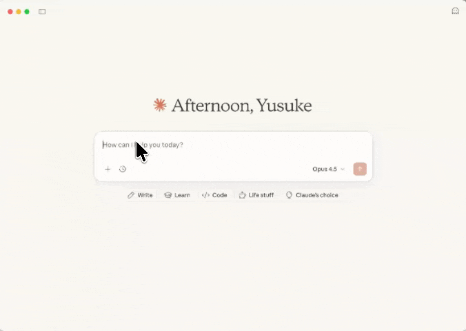

# MCP App with Hono

Experimental implementation of [MCP Apps](https://github.com/modelcontextprotocol/ext-apps) using Hono and Cloudflare Workers with [MCP TypeScript SDK v2](https://github.com/modelcontextprotocol/typescript-sdk).

The official examples use Express, but this project demonstrates how to build MCP Apps with Hono on Cloudflare Workers.

## Demo



## Setup

```bash
npm install
```

## Development

```bash
npm run build  # Build the UI
npm run dev    # Start the Worker with Wrangler
```

## Deploy

```bash
npm run deploy  # Includes build
```

## Files

- `index.html` - Vite build entry point for the UI
- `src/index.ts` - Hono app entry point, handles `/mcp` endpoint with Streamable HTTP transport
- `src/mcp-server.ts` - MCP server definition, registers `get-time` tool and UI resource
- `src/mcp-app.ts` - Frontend UI app, connects to the MCP server and calls tools

## Author

Yusuke Wada <https://github.com/yusukebe>
